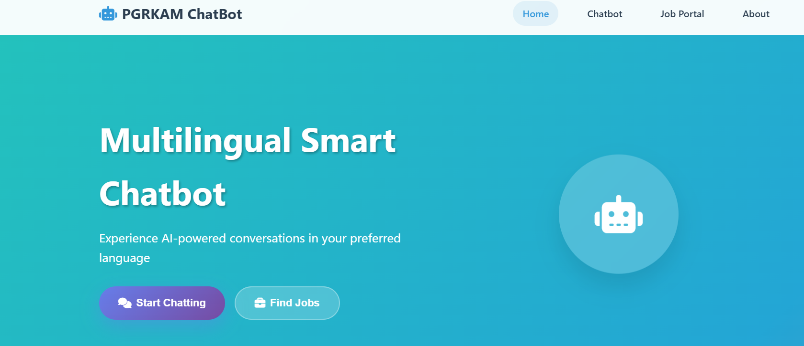
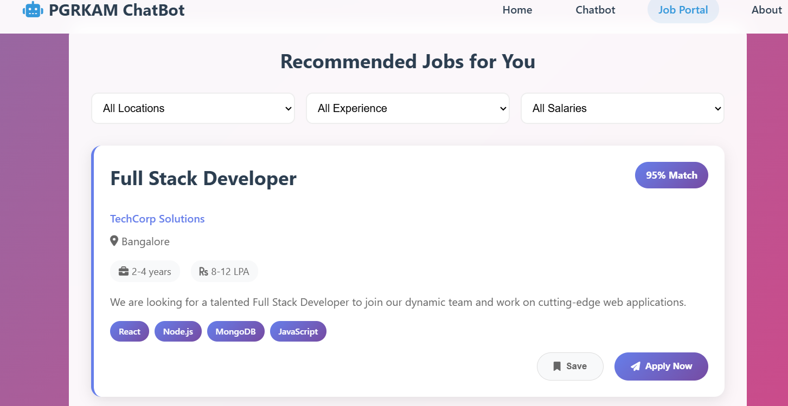
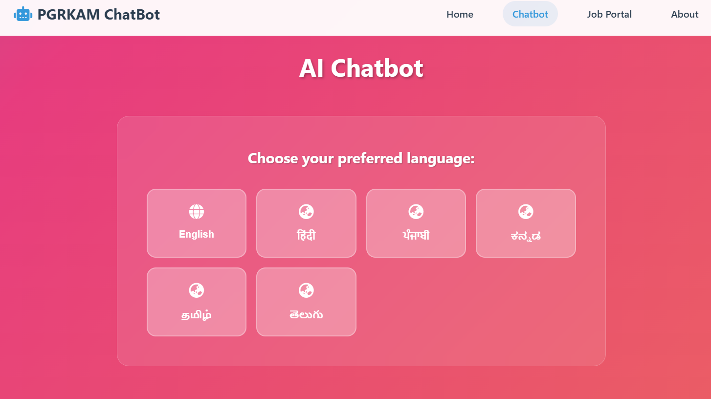
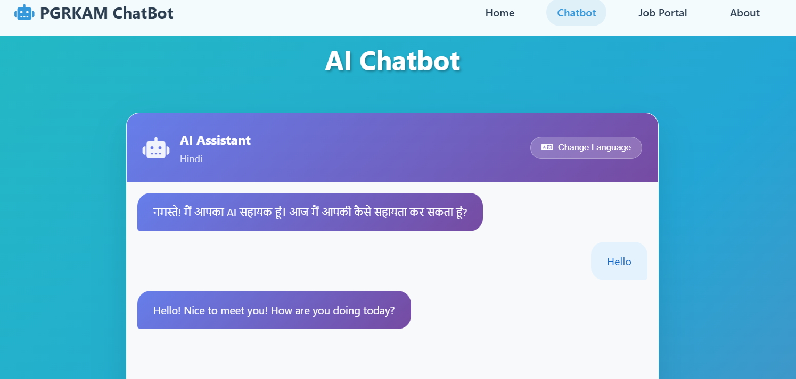

# 🤖 Multilingual Smart Chatbot for PGRKAM Portal

An AI-powered multilingual chatbot developed to improve user experience on the **Punjab Ghar Ghar Rozgar and Karobar Mission (PGRKAM)** platform by providing intelligent assistance, job recommendations, multilingual communication, and seamless portal navigation.

---

## 📌 Project Overview

The Punjab Ghar Ghar Rozgar and Karobar Mission (PGRKAM) portal offers multiple employment-related services including:

- Job opportunities
- Skill development programs
- Career guidance
- Self-employment schemes
- Foreign study counseling
- Training resources

Although the platform provides valuable services, users often face difficulties finding relevant information quickly because of multiple modules and navigation complexity.

This project solves that challenge by introducing an AI-powered multilingual chatbot that assists users instantly.

The chatbot enables users to:

✅ Ask employment-related questions

✅ Receive personalized job recommendations

✅ Access information in multiple languages

✅ Navigate directly to relevant sections

✅ Improve accessibility for users from different language backgrounds

---

# 🎯 Problem Statement

Users visiting the PGRKAM portal frequently encounter:

- Difficulty navigating multiple services
- Delayed information discovery
- Language barriers
- Lack of personalized assistance
- Increased effort to locate job opportunities

The existing system lacks an intelligent assistant capable of guiding users efficiently.

This project addresses these limitations by developing an AI-driven multilingual chatbot that delivers:

### Instant Query Resolution
AI-generated responses to user questions.

### Personalized Job Recommendations
Smart job suggestions based on user interests and preferences.

### Multilingual Communication
Support for:

- English
- Hindi
- Punjabi

(Optional expansion available for Kannada, Tamil, Telugu and additional regional languages.)

### Seamless Navigation
Users are guided directly to the required resources.

---

# 🚀 Key Features

## 🌍 Multilingual Support

Supports multiple languages using AI translation capabilities:

- English
- Hindi
- Punjabi
- Extensible language architecture

---

## 💼 Smart Job Recommendations

Provides intelligent recommendations by analyzing:

- User preferences
- Skills
- Experience filters
- Salary filters
- Location preferences

---

## 🤖 AI-Powered Conversational Assistant

Users can:

- Ask questions naturally
- Receive instant responses
- Obtain career guidance
- Discover portal services

---

## 🔍 Job Portal Integration

Integrated recommendation interface includes:

- Location filtering
- Experience filtering
- Salary filtering
- Skill matching
- Job saving functionality

---

## 🎙️ Voice & Text Interaction

Supports:

- Text-based interaction
- Voice-enabled multilingual communication

---

## 📱 Responsive User Interface

Optimized for:

- Desktop
- Mobile devices
- Tablets

---

# 🖼️ Application Screenshots

## 🏠 Home Page



The landing page introduces the multilingual chatbot and provides direct access to:

- AI chatbot
- Job portal
- Navigation services

---

## 💼 Job Recommendation Portal



Users receive:

- Recommended jobs
- Match percentages
- Salary insights
- Experience requirements
- Apply and save functionality

---

## 🌐 Language Selection Interface



Users can select their preferred communication language before interacting with the chatbot.

Supported languages:

- English
- Hindi
- Punjabi
- Kannada
- Tamil
- Telugu

---

## 🤖 Chatbot Interface



AI assistant provides:

- Real-time responses
- Multilingual communication
- Personalized interaction

---

# 🏗️ System Architecture

```
User
 ↓
Frontend Interface
 ↓
Language Selection Module
 ↓
Chat Processing Engine
 ↓
AI Response Generation
 ↓
Translation Layer
 ↓
Job Recommendation Module
 ↓
PGRKAM Resources & Database
 ↓
Response Delivery
```

---

# ⚙️ Technology Stack

## Frontend

- HTML5
- CSS3
- JavaScript

## Backend

- Python
- Flask

## AI & NLP

- Natural Language Processing (NLP)
- AI Conversational Engine

## Translation Services

Google Cloud Translation API *(Optional)*

## Database

- SQLite / Firebase / PostgreSQL *(based on implementation)*

## Deployment

- GitHub Pages (Frontend)
- Flask Server / Cloud Deployment

---

# 📂 Project Structure

```
Multilingual-Smart-Chatbot-for-PGRKAM/
│
├── frontend/
│   ├── index.html
│   ├── chatbot.html
│   ├── jobportal.html
│   ├── styles/
│   └── assets/
│
├── backend/
│   ├── app.py
│   ├── chatbot_engine.py
│   ├── translation_service.py
│   └── recommendation_system.py
│
├── images/
│   ├── ss1.png
│   ├── ss2.png
│   ├── ss3.png
│   └── ss4.png
│
├── requirements.txt
├── README.md
└── LICENSE
```

---

# 🔄 Workflow

### Step 1 — User opens PGRKAM chatbot

↓

### Step 2 — Select preferred language

↓

### Step 3 — Enter query or use voice input

↓

### Step 4 — AI processes user intent

↓

### Step 5 — Translation layer converts input (if required)

↓

### Step 6 — Recommendation engine analyzes context

↓

### Step 7 — Chatbot returns response

↓

### Step 8 — User receives jobs/resources/navigation guidance

---

# 🛠️ Installation Guide

## 1 Clone Repository

```bash
git clone https://github.com/yourusername/Multilingual-Smart-Chatbot-for-PGRKAM.git
```

## 2 Navigate to Project

```bash
cd Multilingual-Smart-Chatbot-for-PGRKAM
```

## 3 Create Virtual Environment

Windows:

```bash
python -m venv venv
venv\Scripts\activate
```

Linux/Mac:

```bash
python3 -m venv venv

source venv/bin/activate
```

---

## 4 Install Dependencies

```bash
pip install -r requirements.txt
```

---

## 5 Configure Google Translation API (Optional)

Create `.env`

```env
GOOGLE_TRANSLATION_API_KEY=your_api_key_here
```

---

## 6 Run Backend Server

```bash
python app.py
```

---

## 7 Open Application

Frontend:

```
http://localhost:3000
```

Backend:

```
http://127.0.0.1:5000
```

---

# 📊 Future Enhancements

Planned improvements:

- Speech-to-text integration
- Resume analyzer
- AI career counseling
- User profile personalization
- Advanced recommendation models
- Interview preparation assistant
- Analytics dashboard
- Regional language expansion

---

# 🔐 Security Considerations

- Secure API key management
- Input validation
- Authentication support
- Data privacy protection

---

# 🧪 Testing Strategy

Testing includes:

### Functional Testing

- Chat responses
- Job recommendations
- Translation accuracy

### UI Testing

- Responsive design validation

### Integration Testing

- Frontend-backend communication

### Performance Testing

- Response latency optimization

---

# 📈 Expected Impact

This chatbot improves:

- User engagement
- Accessibility
- Employment information discovery
- Portal usability
- Digital inclusion across language groups

---

# 👩‍💻 Developed For

**Capstone Project**

Multilingual Smart Chatbot for Punjab Ghar Ghar Rozgar and Karobar Mission (PGRKAM)

Designed to simplify employment-related digital services through AI-driven multilingual assistance.

---

# 🤝 Contribution

Contributions are welcome.

Steps:

1. Fork repository

2. Create branch

```bash
git checkout -b feature-name
```

3. Commit changes

```bash
git commit -m "Added feature"
```

4. Push branch

```bash
git push origin feature-name
```

5. Open Pull Request

---

# 📜 License

This project is licensed under the MIT License.

---


If you found this project useful:

⭐ Star this repository

